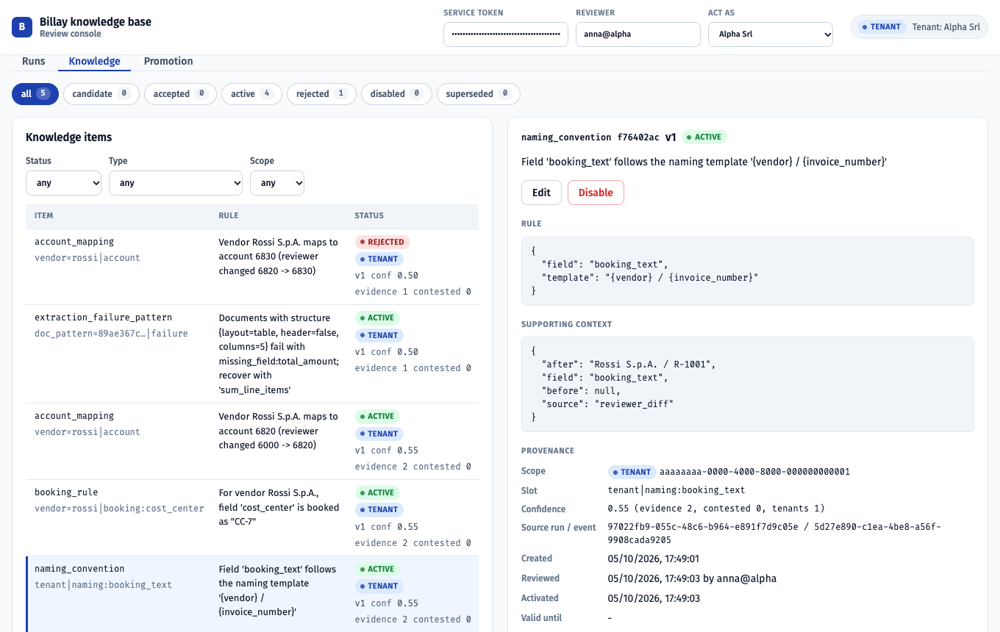
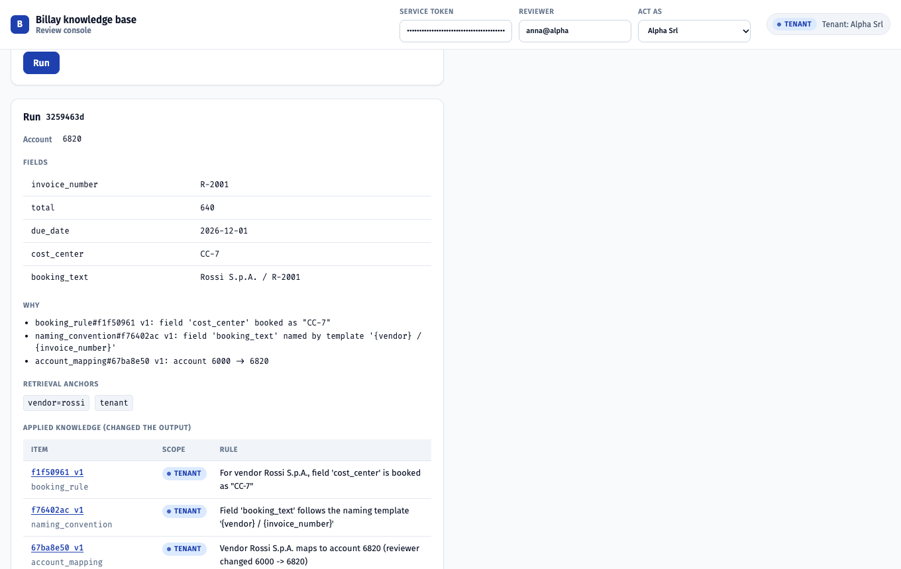

# Billay self-learning knowledge base (MVP)

A memory and feedback layer for the Billay invoice agent. Every reviewer decision on an agent run
(accepted, adjusted, rejected, failed) becomes a structured **knowledge candidate**. A human moves
candidates through a lifecycle (candidate -> accepted -> active). Only active knowledge reaches the
next run, and every run records which knowledge it retrieved and which knowledge changed its output,
pinned to the version it used. Knowledge lives in two scopes: **tenant** memory, isolated by
PostgreSQL row-level security, and **global** memory, which only receives structural, sanitized
patterns that several tenants hit independently and that a platform reviewer still has to approve.

No model is trained or called. The invoice agent is a deterministic mock behind a LangGraph graph,
and the extractor that turns feedback into candidates is deterministic too. That is deliberate: the
assignment asks for a reliable memory layer, not for model work, and values clear reasoning and
reliable behavior over sophistication. The two seams where an LLM would plug in are explicit, and
whatever it proposed would still be a candidate under the same review, sanitizer and isolation.





## Contents

1. [The assignment, in short](#the-assignment-in-short)
2. [Quick start](#quick-start)
3. [A tour of the dashboard](#a-tour-of-the-dashboard)
4. [How it works](#how-it-works)
5. [The four scenarios](#the-four-scenarios)
6. [The brief, point by point](#the-brief-point-by-point)
7. [Reliability: idempotency, concurrency, failure modes](#reliability-idempotency-concurrency-failure-modes)
8. [Design decisions](#design-decisions)
9. [Known limits and how they would be closed](#known-limits-and-how-they-would-be-closed)
10. [Layout and checks](#layout-and-checks)

## The assignment, in short

- Learn from adjusted, rejected and failed runs, and optionally from accepted ones.
- Two scopes: tenant memory that never leaks to another tenant, and global memory that only holds safe, transferable knowledge.
- Feedback becomes a candidate, not permanent knowledge. Each item has a scope, a tenant, its source run and event, a type, the rule, context, a status, timestamps and a version history. A reviewer can accept, edit, reject and disable.
- At runtime: how memories are selected, how tenant and global knowledge combine, how conflicting or outdated knowledge is handled, and how a result traces back to the knowledge that influenced it.
- TypeScript / Node.js, PostgreSQL, LangChain / LangGraph where useful; external invoice processing may be mocked.
- Deliverables: a working MVP, a README, an architecture overview and four example scenarios.

## Quick start

Prerequisites: Node 22+, Docker. Google Chrome only for the optional browser test.

```sh
cp .env.example .env        # replace every change-me value (for example: openssl rand -hex 24)
docker compose up -d        # PostgreSQL 16 on localhost:5432
npm install                 # API and dashboard (npm workspaces)
npm run migrate             # SQL migrations in db/migrations, then role passwords from .env
npm run seed                # five tenants with fixed ids (A..E)

npm run scenario:all        # the four scenarios, each against a reset database (or scenario:1 .. scenario:4)
npm test                    # 53 tests against the real database (row-level security included)

npm run dev                 # API on http://127.0.0.1:3000
npm run web                 # review dashboard on http://localhost:5173 (second terminal)
npm run e2e                 # drives the dashboard in a real Chrome: 33 checks (API and web must be running)

npm run promote             # the global promotion job from the command line
npm run check               # typecheck + lint + dead-code scan + tests
npm run db:reset            # development only: wipe every row and re-seed the tenants
```

A process that starts with a `change-me` placeholder still in `.env` says so in its first log line.
The application itself never hard-deletes anything: no application role holds the `DELETE` privilege.

## A tour of the dashboard

The dashboard is a platform console. It asks for the `SERVICE_TOKEN` from your `.env` and a reviewer
name, then lets you act as the platform or as any tenant. Every action goes through the same API and
the same row-level security as a request over the network; the console only chooses which identity
each request carries.

1. **Runs.** Pick an example invoice (or type one), run the agent, and read the suggestion: the
   account, every field, one "why" line per applied rule, the retrieval anchors, and three lists of
   knowledge: applied (changed the output), retrieved (handed to the agent), shadowed global (a
   tenant item won the slot). Give feedback on the run: accept it, adjust it (the diff that will be
   sent is previewed), reject it, or report a failure. Open any recent run to see its trace, pinned to
   the versions it used, next to each item's current status.
2. **Knowledge.** The queue at a glance (status chips), filters, and one panel per item: rule,
   supporting context, provenance, conflicts, version history, and the actions the item's status
   allows: accept (optionally with an expiry date), resolve a conflict, edit as a new version, reject,
   disable. Global items accept only the platform reviewer.
3. **Promotion.** As the platform reviewer, run the promotion job and read every decision with its
   reason: promoted, skipped (not enough tenants, or a global item already exists) or refused (type
   never generalizes, or the sanitizer found residue).

Switch "Act as" to another tenant and the same screens show nothing of the first one.

## How it works

```
 invoice --> POST /runs --> [retrieve] --> [generate] --> [trace] --> suggestion + applied/retrieved knowledge
                               |              |              |
                        active items     mock agent     runs + run_knowledge_trace (version pinned)
                        by anchor        applies rules
                                                                       |
 reviewer decision --> POST /feedback --> accepted: reinforce applied  |
                                          adjusted / rejected / failed: extractor --> CANDIDATES
                                                                                        |
 reviewer --> accept / edit / reject / disable / resolve-conflict ---------> ACTIVE (one per slot)
                                                                                        |
 platform --> promotion job: type gate, >= 3 tenants, no global yet, sanitizer ---> GLOBAL CANDIDATE
```

Every item is about one **anchor** (what retrieval looks for: `vendor=rossi`, `tenant`,
`doc_pattern=<sha1>`) and fills one **slot** (`vendor=rossi|account`), of which at most one item is
active per scope and tenant. Retrieval takes everything active about the invoice's vendor, its
document pattern and the tenant as a whole; on the same slot a tenant item shadows the global one.

What a correction teaches, from the narrowest reading to the widest, and never wider than the
vendor unless a template proves the value is derived rather than copied:

| Reviewer changes | Candidate | Scope of the rule |
|---|---|---|
| the account | `account_mapping` | this vendor |
| a field to a value another field already holds | `field_mapping` (`to` derives from `from`) | this vendor |
| a text that embeds invoice values (`Rossi S.p.A. / R-1001`) | `naming_convention` with a template (`{vendor} / {invoice_number}`) | the whole tenant |
| any other field value | `booking_rule` with the literal value | this vendor |
| rejects a suggestion without correcting it | `account_veto` (the agent answers `UNMAPPED` instead of guessing) | this vendor |
| reports a structural extraction failure | `extraction_failure_pattern` with a recovery strategy | this vendor, promotable to global |

A transient failure (timeout, rate limit, upstream 5xx) is recorded on the run and teaches nothing.

## The four scenarios

Each scenario resets the database, drives the real API in-process and asserts what it prints.

| Command | What it demonstrates |
|---|---|
| `npm run scenario:1` | A correction becomes a candidate; the candidate is inert; accepting it changes the next run; accepting that run reinforces the rule; feedback is idempotent and a run takes one decision; a retried run with the same `Idempotency-Key` returns the run already created; one correction teaches an account, a vendor booking value and a tenant-wide naming template; tenant B never sees any of it. |
| `npm run scenario:2` | A dirty failure payload (vendor name, IBAN, amount, email) becomes a candidate that carries structural facts only; a transient failure creates nothing; a rejected run becomes a veto that makes the agent ask instead of guess; an accepted failure pattern ships its recovery strategy with the next suggestion. |
| `npm run scenario:3` | Edit creates version 2 while version 1 stays active; a malformed edit is refused; accepting v2 supersedes v1; a conflicting correction is parked until a reviewer resolves it; reject and disable; the version chain; a past run still names the version it used after all of that. |
| `npm run scenario:4` | Three tenants hit the same document pattern; promotion creates a sanitized global candidate without a single tenant or vendor name; a tenant cannot accept it, the platform can; a fourth tenant benefits from it, a tenant with its own pattern shadows it; accepted runs reinforce the global item through the service role; the same evidence for an account mapping is refused. |

## The brief, point by point

| The brief asks | How this MVP answers | Where to look |
|---|---|---|
| Learn from adjusted runs (account mapping, field mapping, naming, other output) | The deterministic extractor turns each changed field into the narrowest safe rule (table above). | `src/internal/feedback/extract-adjusted.ts`, scenario 1, `tests/extract.test.ts` |
| Learn from rejected runs | Applied items are marked as contested; the rejected account becomes a veto candidate. A second rejection extends the veto as a new version. | `src/internal/feedback/extract.ts`, `persist-candidate.ts`, scenario 2 |
| Learn from failed runs when the failure carries information | Transient codes teach nothing; structural failures become a document-pattern rule keyed by a hash of a closed list of structural features. | `src/internal/feedback/extract-failed.ts`, scenario 2 |
| Strengthen knowledge on repeated success | `accepted` feedback adds evidence and confidence to every applied item, tenant and global. | `src/internal/feedback/ingest.ts`, scenario 1, scenario 4 |
| Tenant memory must never influence another tenant | Row-level security in PostgreSQL: the API connects as a role that cannot bypass it and sets the tenant per transaction. A query with no `WHERE` clause still cannot cross tenants. | `db/migrations/002_rls.sql`, `tests/rls.test.ts` |
| Global memory holds only safe, transferable knowledge | Four gates: only document-structure patterns are eligible, at least three distinct tenants, no existing global item, and an allowlist sanitizer with a residue check. The result is a candidate for the platform reviewer. | `src/internal/promotion/`, scenario 4, `tests/promotion.test.ts`, `tests/sanitize.test.ts` |
| Candidate -> accepted -> active, with accept / edit / reject / disable | The lifecycle module; one active truth per slot enforced by a partial unique index; edits are new versions; delete is a status. | `src/internal/knowledge/lifecycle.ts`, scenario 3, `tests/lifecycle.test.ts` |
| Each item has scope, tenant, source, type, rule, context, status, timestamps, versions | Columns of `knowledge_items`, plus `knowledge_evidence` for every supporting feedback event. | `db/migrations/001_schema.sql`, `ARCHITECTURE.md` |
| A minimal API or simple UI for the lifecycle | A Fastify API and a React dashboard that runs the agent, gives feedback, reviews knowledge and runs promotion, exercised end to end in a real browser. | `src/http/`, `web/`, `web/e2e/flow.mjs` |
| How relevant memories are selected | By anchor: everything active about the vendor, the document pattern and the tenant. A rule that adds a field the invoice does not carry yet is still found. | `src/internal/runs/retrieve.ts`, `tests/retrieval.test.ts` |
| How tenant and global knowledge combine | One query over both scopes; on the same slot the tenant item shadows the global one whatever its confidence, and the shadowed item is reported. | `src/internal/runs/retrieve.ts`, scenario 4 |
| How conflicting or outdated knowledge is handled | A conflicting candidate is marked, parked on accept, and resolved by a reviewer. Outdated knowledge leaves through supersede, disable or an expiry date; the database refuses two active items on one slot even in a race. | `src/internal/knowledge/lifecycle.ts`, scenario 3, `tests/lifecycle.test.ts` |
| How a result traces back to the knowledge that influenced it | Every run stores `retrieved` and `applied` items with the version used, and its whole output; the run response and `GET /runs/:id` expose it, and the trace stays correct after edits. | `src/internal/runs/repository.ts`, scenario 3 |
| TypeScript / Node, PostgreSQL, LangGraph | Node 22, strict TypeScript, raw SQL migrations and `pg`, a LangGraph `StateGraph` for the run. | `package.json`, `src/internal/runs/graph.ts` |

## Reliability: idempotency, concurrency, failure modes

| Concern | Behavior | Proof |
|---|---|---|
| Retried run | `POST /runs` accepts an optional `Idempotency-Key` (unique per tenant). A retry returns the run already created, with `replayed: true` and the stored output, and creates no second row. Two concurrent calls with the same key end with one run: the loser of the race hits the unique constraint and reads the winner. Without a key every call is a new run, which is what a reprocessing is. | `tests/runs.test.ts`, scenario 1 |
| Retried feedback | One decision per run. The same decision again is a no-op (`idempotent_replay: true`, HTTP 200); a different decision is `409 run_already_reviewed`. | `tests/feedback.test.ts`, scenario 1 |
| Retried review action | Accepting an active item is `409 invalid_transition`; disabling a disabled item returns it unchanged; running promotion twice skips what already exists. No action has a double effect. | `tests/lifecycle.test.ts`, `tests/promotion.test.ts` |
| Two reviewers, one slot | Row lock on the item, an application check that parks a conflict, and the partial unique index as the last line: a race that slips past the check is refused with `409 active_conflict`. | `tests/lifecycle.test.ts` |
| Two reviewers, one run | The run row is locked while its feedback is recorded, so the second decision sees the first. | `src/internal/feedback/ingest.ts` |
| Global reinforcement | Runs in a second, service-role transaction after the tenant transaction committed, because a tenant connection must never write a global row. If that second step fails, the tenant's decision stands and only the global counter is missed. | `src/internal/feedback/ingest.ts`, scenario 4 |
| Duplicate candidates | An identical pending candidate is strengthened, an identical active item is reinforced; neither is duplicated. Two simultaneous identical corrections from different runs can still produce two candidates; accepting one parks the other as a conflict. | `tests/feedback.test.ts` |
| Migrations | All pending files run in one transaction under an advisory lock: a second migrator waits and finds nothing to apply, and a failing file leaves no half-applied schema. | `src/infrastructure/db/migrate.ts` |
| Configuration | No secret has a default; a missing one stops the process with its name; a `change-me` placeholder is reported at startup. | `tests/env.test.ts` |

## Design decisions

- **Rules are stored as slots, not as free text.** Retrieval is by anchor; uniqueness is by slot.
  Exact keys are deterministic, indexable and explainable; embeddings would add a model,
  non-determinism and a threshold without a demonstrated need.
- **Never generalize wider than the evidence.** A corrected cost center on one Rossi invoice is a
  rule for Rossi, not for the tenant. Only a template inferred from the invoice's own values is
  tenant-wide, and only document-structure patterns can become global.
- **Humans activate knowledge.** Candidates are inert. Conflicts are marked and parked, never
  auto-resolved. Rejections count against an item but never disable it on their own.
- **Edits are new versions.** The row a past run used is never changed, so "why did March's invoice
  get account 6820" has an answer forever.
- **Isolation is a database guarantee, not a convention.** The application role cannot bypass
  row-level security, cannot write global rows and cannot delete.
- **Allowlist over denylist for global knowledge.** Structural values must be lowercase identifiers
  from a closed list of fields; the description is regenerated; a residue check looks for IBANs,
  emails, amounts, long numbers and every known tenant or vendor name. The safe failure is a false
  rejection, which is reported with its reason.
- **A rule is only stored if the agent can apply it.** Every type has a schema; an edit that does
  not fit is refused with the issues.
- **Authentication is a stand-in.** `X-Service-Token` and `X-Tenant-Id` select the database role and
  tenant; the guarantee lives in RLS. A real identity provider replaces `src/http/actor.ts` only.
- **No LLM call anywhere.** The extractor interface and the `generate` node are the two seams.

## Known limits and how they would be closed

- **Near-miss document structures** (a six-column table against a five-column pattern) do not
  match. Next: a vector fallback over the same structural features, still gated by the same lifecycle.
- **Free-text reviewer notes** ("this vendor is always freight") are not read. Next: an LLM-backed
  extractor behind the same `KnowledgeExtractor` interface, compared against the deterministic one
  on acceptance rate before it is trusted.
- **Template inference can over-match** a number that happens to appear in a text. The candidate is
  reviewed before it is active, and the reviewer sees the template.
- **No automatic hygiene**: no confidence decay, no auto-disable above a contested ratio, no canary
  activation of global items for a subset of tenants. The counters exist; the policy is a product decision.
- **Operations**: header-based identity, no per-reviewer permissions, no pagination on listings, no
  rate limiting, no metrics. The promotion job groups active items in memory, which is fine for
  thousands of items and would become a batched `GROUP BY` beyond that.

## Layout and checks

```
db/migrations/           001_schema.sql (tables, invariants)  002_rls.sql (roles, grants, policies)
src/config/env.ts        validated environment (no secret has a default; placeholders are reported)
src/http/                app, actor resolution, error envelope
src/infrastructure/db/   pools per role, withTenant / withService / withAdmin, migrate, seed
src/internal/knowledge/  types, subjects (anchors and slots), per-type rule schemas, repository, lifecycle, routes
src/internal/feedback/   extractor (adjusted / rejected / failed), candidate persistence, ingestion, routes
src/internal/runs/       retrieval, mock agent, run graph (LangGraph), idempotent start, trace repository, routes
src/internal/promotion/  sanitizer, promotion job, report, routes
scripts/                 migrate, seed, reset, promote
scenarios/               harness (in-process API) and the four scenarios
tests/                   extractor, sanitizer, RLS, feedback, lifecycle, retrieval, promotion, runs, env
web/                     React review dashboard (Vite) and its browser test (web/e2e)
```

`npm run check` runs the TypeScript compiler on both workspaces, ESLint (complexity at most 10,
functions at most 80 lines, files at most 300 lines), `knip` (no unused file, export or dependency)
and the test suite. `ARCHITECTURE.md` has the data model, the state machine, the extraction and
promotion rules, the retrieval mechanics and the decisions log.
